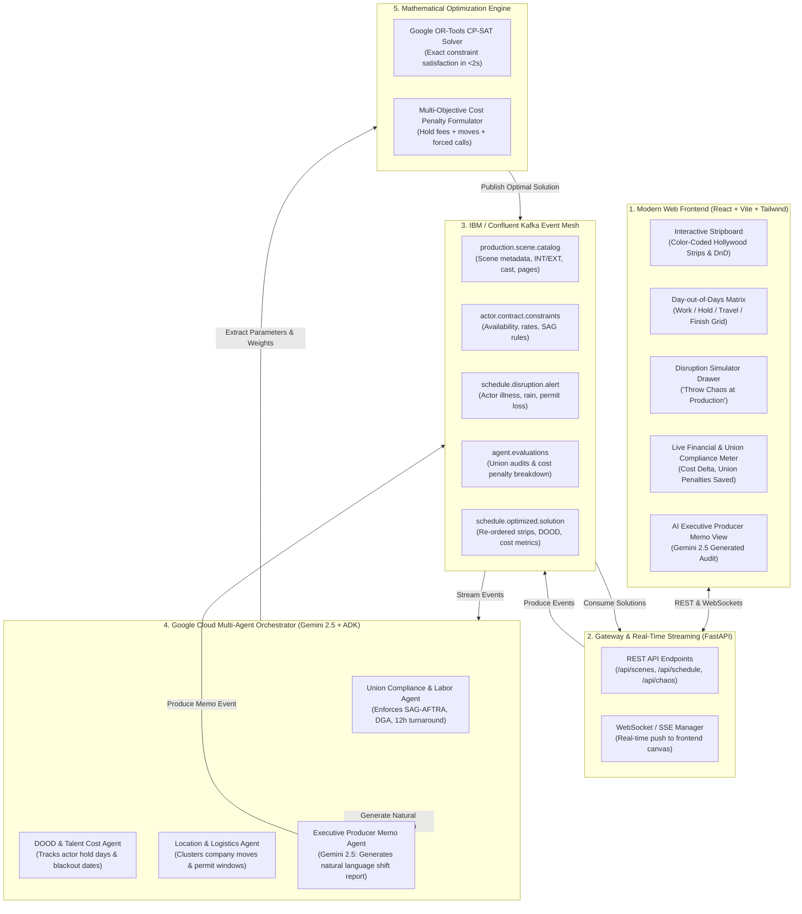

# Architecture & Technical Specification: StripBoard Optimizer (`P-CINEMA-HACK-3.1`)

> **Challenge:** [Devpost Agentic Cinema: The Blockbuster Hackathon](https://agentic-cinema.devpost.com/)  
> **Target Track:** **IBM / Confluent Partner Track**  
> **Core Technologies:** Confluent Kafka Event Mesh, Google Cloud Gemini 2.5 & ADK, Google OR-Tools CP-SAT Solver, FastAPI, React + Tailwind + Lucide  
> **Repository Target:** `stripboard-optimizer`

---

## 1. Executive Summary & Problem Domain

### The Real-World Film Industry Crisis
In film and television production, the **One-Liner Schedule (Stripboard)** is the master operational blueprint that dictates which scenes are filmed on which calendar day across a 45-to-120-day production. 

Generating and maintaining this schedule is an **NP-hard combinatorial optimization problem** under intense real-world constraints:
1. **SAG-AFTRA & DGA Labor Union Turnaround Rules:** Actors must receive a minimum **12-hour rest period** between wrap time and call time the next morning. Violations trigger punitive union penalties ("Forced Calls") costing upwards of **$5,000 per actor per day**. Transitioning from night shoots back to day shoots requires a **36-hour weekend turnaround**.
2. **Day-out-of-Days (DOOD) Holding Costs:** Under standard theatrical SAG contracts, if an actor works Day 1 (Monday) and Day 5 (Friday), the studio must pay full contract rates for Tuesday, Wednesday, and Thursday as "Hold Days" even though the actor does not step foot on set. Inefficient schedules waste **$150,000 to $500,000 in idle hold fees**.
3. **Company Moves & Location Clustering:** Moving a 150-person crew, grip trucks, and catering across town mid-day ("Company Move") costs **$50,000+** and consumes 3 to 4 hours of daylight. All scenes in a single location must be tightly clustered.
4. **Talent Availability Windows:** A-list actors frequently have strict multi-week availability windows, Broadway leaves of absence, or press tour blackout dates.

### The Problem When Chaos Strikes
When real-world disruptions strike on set (e.g., Lead actor tests positive for COVID, an unseasonal storm floods an exterior location, a historic permit is revoked), the Line Producer and 1st AD are forced into **3 sleepless days of manual strip rearranging**. Under intense pressure, manual rescheduling produces mathematically sub-optimal schedules that cause massive budget hemorrhaging and union grievances.

### The StripBoard Optimizer Solution
**StripBoard Optimizer** is an autonomous event-driven multi-agent system that pairs an **IBM / Confluent Kafka Event Mesh** with a **Google OR-Tools CP-SAT constraint solver** and **Gemini 2.5**. When a disruption alert is received, the system evaluates all union rules and financial objectives, recalculating an optimal 60-day schedule in **under 3 seconds** while providing an automated executive Line Producer memo explaining every shift and dollar saved.

---

## 2. End-to-End System Architecture



---

## 3. Multi-Agent Orchestration Architecture

The system utilizes an ensemble of specialized autonomous agents coordinated over the Kafka message bus and powered by **Google Cloud Agent Development Kit (ADK)** and **Gemini 2.5**:

| Agent Name | Core Responsibilities & Rules Enforced | Input Topic | Output / Artifact |
| :--- | :--- | :--- | :--- |
| **Union Compliance & Labor Rules Agent** (`SAG_DGA_Agent`) | • SAG-AFTRA 12-hour overnight rest turnaround.<br>• IATSE 6-day consecutive workweek limits.<br>• 36-hour weekend turnaround when pivoting from Night shoots to Day shoots.<br>• Detects and prices punitive "Forced Call" violations ($5,000/actor/day). | `schedule.disruption.alert`<br>`schedule.candidate.proposals` | Labor compliance score & penalty matrix |
| **Actor Availability & DOOD Minimizer Agent** (`DOOD_Agent`) | • Generates Day-out-of-Days matrix: `W` (Work), `H` (Hold), `T` (Travel), `F` (Finish).<br>• Penalizes idle days between first and last work day ($1,500–$5,000/day).<br>• Enforces hard talent blackout dates (press junkets, prior theater bookings). | `actor.contract.constraints`<br>`schedule.disruption.alert` | DOOD table & holding cost penalties |
| **Location & Logistics Cluster Agent** (`Logistics_Agent`) | • Clusters all interior and exterior scenes within the same physical location.<br>• Penalizes intra-day "Company Moves" ($50,000/move penalty).<br>• Enforces municipal permit expiration dates and seasonal lighting windows. | `production.scene.catalog`<br>`schedule.disruption.alert` | Location clustering constraints |
| **Master Schedule Arbitrator (Solver Agent)** (`CPSAT_Solver_Agent`) | • Ingests constraints from Agents 1–3.<br>• Builds mathematical CP-SAT model and executes Google OR-Tools solver.<br>• Guarantees mathematically optimal or near-optimal schedule in $<2$ seconds. | `agent.evaluations` | `schedule.optimized.solution` |
| **Executive Director & Memo Agent** (`Gemini_Memo_Agent`) | • Uses Gemini 2.5 Flash with structured output.<br>• Synthesizes complex solver delta into a professional, human-readable Line Producer Memo explaining: why dates shifted, cost savings achieved, and contingency mitigations. | `schedule.optimized.solution` | `executive.producer.memo` |

---

## 4. Mathematical Formulation (CP-SAT Solver)

### 4.1. Decision Variables
- $X_{s, d} \in \{0, 1\}$: Binary indicator whether scene $s \in S$ is scheduled on shoot day $d \in D$.
- $\text{Work}_{a, d} \in \{0, 1\}$: Binary indicator whether actor $a \in A$ works on shoot day $d$.
- $\text{FirstWorkDay}_{a} \in [1, |D|]$, $\text{LastWorkDay}_{a} \in [1, |D|]$: Bounding span of actor $a$'s engagement.
- $\text{HoldDay}_{a, d} \in \{0, 1\}$: Binary indicator whether day $d$ is an idle hold day for actor $a$ ($\text{FirstWorkDay}_a \le d \le \text{LastWorkDay}_a$ and $\text{Work}_{a,d} = 0$).
- $\text{LocationUsed}_{l, d} \in \{0, 1\}$: Binary indicator whether location $l \in L$ is used on shoot day $d$.

### 4.2. Hard Constraints (Must NEVER be violated)
1. **Scene Assignment Uniqueness:**  
   $$\sum_{d \in D} X_{s, d} = 1 \quad \forall s \in S$$
2. **Daily Shooting Hours Cap (10-Hour Maximum Day):**  
   $$\sum_{s \in S} \text{DurationMinutes}(s) \cdot X_{s, d} \le 600 \quad \forall d \in D$$
3. **Actor Work Linking:**  
   $$\text{Work}_{a, d} \ge X_{s, d} \quad \forall s \in S, \forall a \in \text{Cast}(s), \forall d \in D$$
4. **Talent Blackout & Illness Dates:**  
   $$X_{s, d} = 0 \quad \forall d \in \text{UnavailableDays}(a), \forall s \text{ where } a \in \text{Cast}(s)$$
5. **Location Permit Windows:**  
   $$X_{s, d} = 0 \quad \forall d \notin \text{PermitWindow}(\text{Location}(s))$$
6. **Precedence Constraints:** (e.g., haircut, physical explosion before interior destruction):  
   $$\sum_{d \in D} d \cdot X_{s_{\text{before}}, d} < \sum_{d \in D} d \cdot X_{s_{\text{after}}, d}$$

### 4.3. Objective Function (Cost Penalty Minimization)
$$\min \quad \mathcal{Z} = W_{\text{hold}} \sum_{a \in A} \sum_{d \in D} \text{HoldDay}_{a,d} \;+\; W_{\text{move}} \sum_{d \in D} \max(0, \sum_{l \in L} \text{LocationUsed}_{l,d} - 1) \;+\; W_{\text{turnaround}} \sum_{a \in A} \sum_{d \in D-1} \text{ForcedCall}_{a, d}$$

**Standard Production Penalty Weights:**
- $W_{\text{hold}} = \$2,000$ / actor / hold day
- $W_{\text{move}} = \$50,000$ / company move
- $W_{\text{turnaround}} = \$10,000$ / SAG forced call violation

---

## 5. Confluent Kafka Event Mesh Architecture

### 5.1. Topic Catalog & Schema Definitions

#### Topic: `production.scene.catalog`
```json
{
  "event_id": "evt_scene_init_001",
  "production_id": "prod_neon_horizon",
  "scenes": [
    {
      "scene_id": "SC_01",
      "scene_number": "1",
      "slugline": "EXT. ABANDONED WAREHOUSE - NIGHT",
      "setting": "NIGHT_EXTERIOR",
      "location": "Warehouse District",
      "pages_eighths": 24,
      "est_shoot_minutes": 240,
      "cast_ids": ["ACTOR_SARAH", "ACTOR_MARCUS"],
      "description": "Marcus ambushes Sarah near the loading docks."
    }
  ]
}
```

#### Topic: `schedule.disruption.alert`
```json
{
  "alert_id": "chaos_alert_9410",
  "production_id": "prod_neon_horizon",
  "disruption_type": "ACTOR_ILLNESS",
  "severity": "CRITICAL",
  "affected_entity_type": "ACTOR",
  "affected_entity_id": "ACTOR_SARAH",
  "unavailable_dates": ["2026-10-14", "2026-10-15"],
  "reason": "Emergency medical quarantine (48-hour doctor order)",
  "timestamp": "2026-10-13T18:30:00Z"
}
```

#### Topic: `schedule.optimized.solution`
```json
{
  "solution_id": "sol_reschedule_881",
  "production_id": "prod_neon_horizon",
  "solver_runtime_ms": 342,
  "objective_cost": 12000,
  "cost_saved_vs_naive": 148500,
  "schedule_by_day": {
    "Day 1": ["SC_04", "SC_07"],
    "Day 2": ["SC_01", "SC_02"]
  },
  "dood_summary": {
    "ACTOR_SARAH": {"work_days": 4, "hold_days": 1, "total_cost": 2000}
  },
  "executive_memo": "Automated Line Producer Memo generated by Gemini 2.5..."
}
```

### 5.2. Resilient Hybrid Kafka Adapter
To ensure frictionless local evaluation and deployment resilience:
- **Primary Mode:** Direct Confluent Cloud connection using SASL/SSL credentials (`confluent-kafka` Python library).
- **Fallback / Zero-Config Mode:** In-memory asynchronous streaming bus matching the exact Confluent Kafka topic contract, ensuring instant startup for testing and demonstration without external cluster blockers.

---

## 6. Frontend User Experience & Visual Design

The UI provides a tactile, professional film production command center:

1. **Hollywood Standard Stripboard Canvas:**
   - Color-coded scene strips conforming to industry standards:
     - 🟡 **Yellow Strip:** Exterior Day
     - ⚪ **White Strip:** Interior Day
     - 🟢 **Green Strip:** Exterior Night
     - 🔵 **Blue Strip:** Interior Night
   - Displays scene number, slugline, cast numbers, page eighths, and estimated shoot time.
   - Interactive drag-and-drop manual tweaking with instant CP-SAT validation.

2. **Day-out-of-Days (DOOD) Interactive Matrix:**
   - Grid mapping Actor Name vs. Shoot Days.
   - High-contrast visual codes:
     - `W` (Work - Deep Green)
     - `H` (Hold - Crimson Red with hold cost badge)
     - `T` (Travel - Orange)
     - `F` (Finish - Purple)

3. **"Throw Chaos at Production" Disruption Drawer:**
   - One-click disruption scenarios:
     - 🤒 *Lead Actor has COVID (48-hr quarantine)*
     - ⛈️ *Severe Flash Flood at Exterior Quarry (Location closed for 3 days)*
     - 📜 *Historic Courthouse Filming Permit Revoked for Day 4*
     - ⏰ *Overtime Spillover / SAG Forced Call Threat*

4. **Real-Time Financial & Union HUD:**
   - **Cost Delta Meter:** Immediate calculation of money saved vs. naive manual rescheduling.
   - **Union Compliance Indicator:** 100% SAG-AFTRA / DGA verified badge.
   - **Solver Benchmark:** Displays re-optimization latency (e.g., `0.28s`).

5. **Gemini Automated Line Producer Memo:**
   - Formats a formal studio memo ready to email to Studio Executives and Department Heads explaining the re-sequencing rationale.

---

## 7. Concrete Project Structure

```text
stripboard-optimizer/
├── ARCHITECTURE.md                  # Master specification document in project root
├── README.md                        # Submission documentation with video link & instructions
├── LICENSE                          # Apache 2.0 open-source license
├── docker-compose.yml               # Container orchestration (FastAPI + React)
│
├── backend/
│   ├── app/
│   │   ├── main.py                  # FastAPI bootstrap & lifespan management
│   │   ├── config.py                # Environment variables (Gemini API key, Confluent config)
│   │   ├── models/
│   │   │   ├── scene.py             # Scene breakdown schema
│   │   │   ├── actor.py             # Actor contract & rate schema
│   │   │   ├── disruption.py        # Chaos disruption schema
│   │   │   └── schedule.py          # Schedule solution & DOOD schema
│   │   ├── solver/
│   │   │   ├── cp_sat_model.py      # Google OR-Tools CP-SAT formulation
│   │   │   ├── dood_calculator.py   # Day-out-of-days matrix builder (W/H/T/F)
│   │   │   └── benchmark.py         # Solver timing and cost comparison benchmarks
│   │   ├── kafka/
│   │   │   ├── client.py            # Unified Confluent Kafka client with resilient fallback
│   │   │   ├── producer.py          # Event emitter for alerts and solutions
│   │   │   ├── consumer.py          # Event listener for background processing
│   │   │   └── topics.py            # Kafka topic definitions and schemas
│   │   ├── agents/
│   │   │   ├── union_agent.py       # SAG-AFTRA turnaround & labor validator
│   │   │   ├── dood_agent.py        # Talent hold-fee optimizer
│   │   │   ├── logistics_agent.py   # Company move clustering agent
│   │   │   └── memo_agent.py        # Gemini 2.5 Line Producer Memo generator
│   │   ├── api/
│   │   │   ├── routes_schedule.py   # Solve, retrieve, and lock schedules
│   │   │   ├── routes_chaos.py      # Inject disruption events
│   │   │   └── websocket.py         # Real-time WebSocket streaming
│   │   └── demo_data/
│   │       └── neon_horizon.json    # Sample feature film: 25 scenes, 6 actors, 5 locations
│   ├── tests/
│   │   ├── test_solver.py           # Unit tests verifying CP-SAT constraints
│   │   └── test_kafka.py            # Unit tests for event serialization
│   └── requirements.txt             # ortools, google-genai, confluent-kafka, fastapi, uvicorn
│
└── frontend/
    ├── package.json
    ├── vite.config.ts
    ├── tailwind.config.js
    ├── index.html
    └── src/
        ├── types/                   # TypeScript interfaces matching backend models
        ├── services/
        │   ├── api.ts               # REST API client
        │   └── websocket.ts         # Real-time socket stream
        ├── components/
        │   ├── Navbar.tsx           # Production header with status badges
        │   ├── Stripboard.tsx       # Hollywood color-coded draggable stripboard
        │   ├── StripItem.tsx        # Individual scene strip component
        │   ├── DoodMatrix.tsx       # Actor Day-out-of-Days matrix table
        │   ├── ChaosDrawer.tsx      # Disruption injection control panel
        │   ├── CostMeter.tsx        # Budget savings and union compliance meter
        │   └── ProducerMemoModal.tsx# Gemini executive memo display
        ├── App.tsx                  # Main layout & state orchestration
        └── main.tsx
```

---

## 8. Implementation Steps & Validation Milestones

| Step | Milestone Deliverable | Validation Criteria |
| :---: | :--- | :--- |
| **1** | **Backend Scaffolding & Data Models** | Pydantic models for scenes, actors, disruptions, and schedules; seed data `neon_horizon.json`. |
| **2** | **OR-Tools CP-SAT Solver Engine** | Mathematical formulation solving 25 scenes across 5 shoot days in $<1$s, minimizing hold days and company moves. |
| **3** | **Confluent Kafka Event Mesh** | Event producer and consumer handling disruption alerts and broadcasting solutions. |
| **4** | **Gemini 2.5 Multi-Agent Orchestration** | Union compliance rules validator and automated Line Producer Memo generation. |
| **5** | **FastAPI Gateway & WebSocket Streaming** | REST endpoints + live push channel communicating with the frontend. |
| **6** | **Interactive React Stripboard & DOOD UI** | Color-coded Hollywood strips, interactive DOOD matrix, chaos simulator drawer, and live HUD. |
| **7** | **End-to-End Verification & Demo Flow** | Ingest disruption, re-solve in $<2$s, verify zero union violations, display $100k+ savings, and generate memo. |
