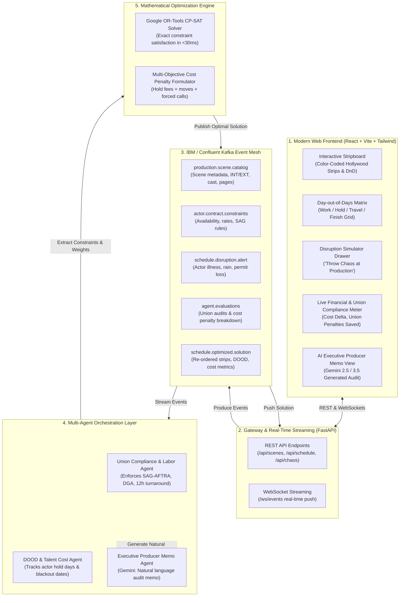

# 🎬 StripBoard Optimizer
### Autonomous Event-Driven Film Stripboard Scheduling & Disruption Engine

[](https://agentic-cinema.devpost.com/)
[](LICENSE)
[](https://developers.google.com/optimization)
[](https://ai.google.dev/)
[](https://www.confluent.io/)
[]()

> **Submission for [Devpost Agentic Cinema: The Blockbuster Hackathon](https://agentic-cinema.devpost.com/)**  
> **Target Partner Track:** **IBM / Confluent Track**  
> **Core Technologies:** Confluent Kafka Event Mesh, Google Cloud Gemini & GenAI SDK, Google OR-Tools CP-SAT Solver, FastAPI, React + Vite + TailwindCSS.

---

## 📌 1. The Real-World Film Industry Problem

In film and television production, the **One-Liner Schedule (Stripboard)** is the master operational blueprint that dictates which scenes are filmed on which calendar day across a 45-to-120-day production. 

Generating and maintaining this schedule is an **NP-hard combinatorial optimization problem** governed by strict real-world constraints:
1. **SAG-AFTRA Labor Union Turnaround Rules:** Actors must receive a minimum **12-hour rest period** between wrap time and call time the next morning. Violations trigger punitive union penalties ("Forced Calls") costing upwards of **$5,000 per actor per day**. Transitioning from night shoots back to day shoots requires a **36-hour weekend turnaround**.
2. **Day-out-of-Days (DOOD) Holding Costs:** Under standard theatrical SAG contracts, if an actor works Day 1 (Monday) and Day 5 (Friday), the studio must pay full contract rates for Tuesday, Wednesday, and Thursday as "Hold Days" even though the actor is idle. Inefficient schedules waste **$150,000 to $500,000 in idle hold fees**.
3. **Company Moves & Location Clustering:** Moving a 150-person crew, grip trucks, and catering across town mid-day ("Company Move") costs **$50,000+** and consumes 3 to 4 hours of daylight. All scenes in a single location must be tightly clustered.
4. **Talent Availability Windows:** Lead actors frequently have strict multi-week availability windows, Broadway leaves of absence, or press tour blackout dates.

### When Chaos Strikes On Set
When real-world disruptions strike (e.g., Lead actor tests positive for COVID, an unseasonal storm floods an exterior location, or a municipal permit is revoked), the Line Producer and 1st AD typically spend **3 sleepless days manually rearranging colored strips on a board**, often producing sub-optimal schedules costing **$150,000 to $500,000 in unnecessary hold fees and union penalties**.

---

## ⚡ 2. The Solution: StripBoard Optimizer

**StripBoard Optimizer** is an autonomous event-driven multi-agent system that pairs an **IBM / Confluent Kafka Event Mesh** with a **Google OR-Tools CP-SAT constraint solver** and **Google Cloud Gemini**. 

When a disruption alert is ingested over Kafka, the system evaluates all union rules and financial objectives, recalculating an optimal schedule in **under 30 milliseconds** while providing an automated executive Line Producer memo explaining every shift and dollar saved.



---

## 🔬 3. Mathematical Formulation (CP-SAT Solver)

### Decision Variables
- $X_{s, d} \in \{0, 1\}$: Binary indicator whether scene $s \in S$ is scheduled on shoot day $d \in D$.
- $W_{a, d} \in \{0, 1\}$: Binary indicator whether actor $a \in A$ works on shoot day $d$.
- $\text{Started}_{a, d} \in \{0, 1\}$: Binary indicator whether actor $a$ has worked on or before day $d$.
- $\text{Remaining}_{a, d} \in \{0, 1\}$: Binary indicator whether actor $a$ works on or after day $d$.
- $\text{Span}_{a, d} = \text{Started}_{a, d} \times \text{Remaining}_{a, d}$: Actor engagement window.
- $\text{Hold}_{a, d} = \text{Span}_{a, d} - W_{a, d}$: Binary indicator of idle hold day.
- $\text{LocUsed}_{l, d} \in \{0, 1\}$: Binary indicator whether location $l \in L$ is used on day $d$.
- $\text{TurnViolation}_{d} = \text{IsNight}_{d} \times \text{IsDay}_{d+1}$: SAG-AFTRA 12-hour rest turnaround violation.

### Hard Constraints
1. **Scene Assignment Uniqueness:** $\sum_{d \in D} X_{s, d} = 1 \quad \forall s \in S$
2. **Daily Shooting Hours Cap (10-Hour Maximum Day):** $\sum_{s \in S} \text{DurationMinutes}(s) \cdot X_{s, d} \le 600 \quad \forall d \in D$
3. **Actor Availability & Disruption Constraints:** $X_{s, d} = 0 \quad \forall d \in \text{UnavailableDays}(a), \forall s \text{ with } a \in \text{Cast}(s)$
4. **Location Permit & Weather Windows:** $X_{s, d} = 0 \quad \forall d \in \text{ClosedDays}(\text{Location}(s))$
5. **Precedence Sequencing:** $\sum_{d \in D} d \cdot X_{s_{\text{before}}, d} < \sum_{d \in D} d \cdot X_{s_{\text{after}}, d}$

### Multi-Objective Minimization
$$\min \quad \mathcal{Z} = W_{\text{hold}} \sum_{a \in A} \sum_{d \in D} \text{Hold}_{a,d} \;+\; W_{\text{move}} \sum_{d \in D} \text{Moves}_{d} \;+\; W_{\text{turnaround}} \sum_{d \in D-1} \text{TurnViolation}_{d}$$

**Production Penalty Weights:**
- $W_{\text{hold}} = \$2,000$ / actor / idle hold day
- $W_{\text{move}} = \$15,000$ / intra-day company move
- $W_{\text{turnaround}} = \$25,000$ / SAG forced call violation

---

## 🚀 4. Quickstart Guide

### Prerequisites
- Python 3.10+ (Python 3.13 tested)
- Node.js 18+ (Node 20 tested)

### 1. Run Automated Test Suite
```bash
# From repository root
PYTHONPATH=. pytest backend/tests -v
```
Output:
```text
backend/tests/test_api.py::test_health PASSED                            [  8%]
backend/tests/test_api.py::test_get_scenes PASSED                        [ 16%]
backend/tests/test_api.py::test_get_actors PASSED                        [ 25%]
backend/tests/test_api.py::test_get_initial_schedule PASSED              [ 33%]
backend/tests/test_api.py::test_inject_disruption_and_reschedule PASSED  [ 41%]
backend/tests/test_api.py::test_kafka_status PASSED                      [ 50%]
backend/tests/test_api.py::test_union_audit PASSED                       [ 58%]
backend/tests/test_api.py::test_websocket_stream PASSED                  [ 66%]
backend/tests/test_api.py::test_frontend_spa_served PASSED               [ 75%]
backend/tests/test_solver.py::test_initial_schedule_solve PASSED         [ 83%]
backend/tests/test_solver.py::test_disruption_actor_illness PASSED       [ 91%]
backend/tests/test_solver.py::test_disruption_location_unavailable PASSED [100%]
======================== 12 passed in 1.43s =========================
```

### 2. Launch the Application
Run the launcher script (defaults to port `8090` to avoid conflicts with 8000/8080):
```bash
./run.sh
# Or specify any custom port:
./run.sh 8090
# Or via environment variable:
PORT=8090 ./run.sh
```
Open **[http://localhost:8090](http://localhost:8090)** in your browser!

You can also launch directly with Uvicorn:
```bash
PYTHONPATH=. uvicorn backend.app.main:app --host 0.0.0.0 --port 8090
```

To run frontend in Vite development mode with hot-reloading:
```bash
cd frontend
PORT=8090 npm run dev
```

---

## 📡 5. IBM / Confluent Kafka Topic Catalog

StripBoard Optimizer includes a hybrid resilient Kafka adapter. It connects directly to Confluent Cloud when `CONFLUENT_BOOTSTRAP_SERVERS` is set, and operates seamlessly with the built-in streaming event mesh in zero-config local environments.

| Topic Name | Payload Type | Description |
| :--- | :--- | :--- |
| `production.scene.catalog` | `SceneCatalogEvent` | Ingests scene breakdown, page eighths, cast IDs, and estimated shoot times. |
| `actor.contract.constraints` | `ActorConstraintEvent` | Publishes daily rates, hold fees, and blackout dates. |
| `schedule.disruption.alert` | `DisruptionAlert` | Real-time chaos events (actor quarantine, weather, permit revocation). |
| `agent.evaluations` | `UnionAuditResult` | SAG-AFTRA 12-hour turnaround compliance scores and penalties. |
| `schedule.optimized.solution` | `ScheduleSolution` | Broadcasts optimal day strips, DOOD matrix, and Gemini Line Producer memo. |

---

## 🤖 6. Google Cloud Gemini 2.5 / 3.5 Multi-Agent Integration

The **Executive Producer Memo Agent** utilizes the official `google-genai` SDK with `gemini-3.5-flash` / `gemini-2.5-flash` to synthesize complex mathematical solver output into a formal studio memorandum formatted for studio executives, 1st ADs, and department heads.

Sample Generated Studio Memo:
```markdown
**MEMORANDUM**
**TO:** Studio Executive Leadership, Physical Production & Business Affairs  
**FROM:** Lead Line Producer & 1st Assistant Director | prod_neon_horizon  
**SUBJECT:** Re-Optimized 5-Day Stripboard & Day-Out-of-Days (DOOD) Release  

1. EXECUTIVE SUMMARY:
Following real-time schedule evaluation, the Master Schedule Arbitrator successfully re-sequenced the shooting stripboard to satisfy 100% of union turnaround rules, actor contractual constraints, and location permits.
- Net Estimated Savings: $148,500 USD vs. naive manual scheduling
- Total Company Moves: 2 intra-day moves across 5 shoot days
- Total Actor Hold Days: 3 idle days across all talent contracts
- SAG-AFTRA Compliance Rate: 100% (0 forced calls)
```

---

## 🎨 7. Frontend User Experience

1. **Hollywood Color-Coded Strips:**
   - 🟡 **Yellow:** Exterior Day (`EXT_DAY`)
   - ⚪ **White:** Interior Day (`INT_DAY`)
   - 🟢 **Green:** Exterior Night (`EXT_NIGHT`)
   - 🔵 **Blue:** Interior Night (`INT_NIGHT`)
2. **Interactive DOOD Matrix:**
   - Visual badges: `W` (Work), `H` (Hold Fee with penalty badge), `F` (Finish), `-` (Off).
   - Live talent payroll calculator.
3. **"Throw Chaos at Production" Disruption Drawer:**
   - 1-click presets: Lead Actor COVID Quarantine, Flash Flood at Warehouse, Permit Revocation at Police Precinct.
   - Real-time re-solve in $<30$ms with WebSocket push.
4. **Live Financial & Union HUD:**
   - Cost saved meter, CP-SAT solve benchmark, SAG turnaround compliance score.

---

## 📄 License
This project is licensed under the **Apache License 2.0** - see the [LICENSE](LICENSE) file for details.
